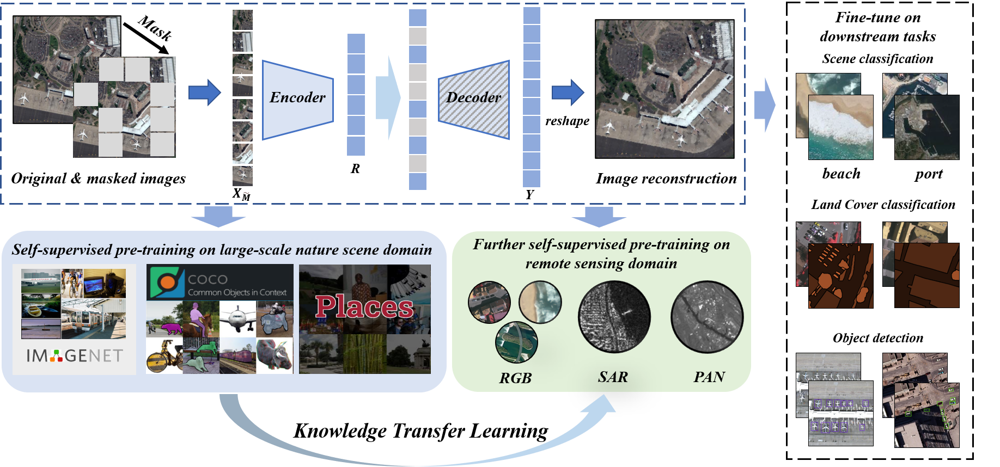

# Consecutive Pretraining: A Knowledge Transfer Learning Strategy with Unlabelled Data for Remote Sensing Domain Promotion

### This repository cotains PyTorch implementation and pretrained models of CSPT. 
### Give a star! ⭐️ if this project helped you.

## Introduction:

Nowadays, under supervised learning, a model pre-trained by a large-scale nature scene dataset and then fine-tuning on a few specific task labeling data, has dominated the knowledge transfer learning and became a consensus for task-aware model training in remote sensing domain (RSD). Unfortunately, due to different categories of imaging data and great challenges of data annotation, there is no a large enough and uniform dataset can support large-scale pre-training in RSD. Moreover, pre-training models on large-scale nature scene dataset by supervised learning and then directly fine-tuning on diversity downstream tasks seems a crude way, which is easily affected by inevitable labeling noise, severe domain gap and task-aware discrepancy. Thus, in our work, considering the self-supervised pre-training and powerful vision transformer (ViT) architecture, a concise and effective knowledge transfer learning strategy based on the idea of not stop pre-training is proposed to gradually bridge the domain gap and transfer knowledge from nature scene domain to RSD, besides it also can release the huge potential of unlabelled data for task-aware model training. 

  

### Pretrained models:
The pre-trained models basde on ViT-B are released in [Model Zoo](https://pan.baidu.com/s/1bhxdjjrVk0jWMs7dnXVQWQ) (code:dspt).

### Updates🌟 :
* May 7, 2022: All pretrained models of various remote sensing downstream tasks are released publicly.
* June 8, 2022: The code about pre-training and fine-tuning is coming soon.

### Installation🚀:
Please refer to [install.md](install.md) for installation.

### Getting Started🚀: 
Please refer to [get_started.md](get_started.md) for the basic usage.

### Acknowledgement
The code is built using the [MAE](https://github.com/facebookresearch/mae), [MMdetection](https://github.com/open-mmlab/mmdetection) and [BEiT](https://github.com/microsoft/unilm/tree/master/beit) repository.
