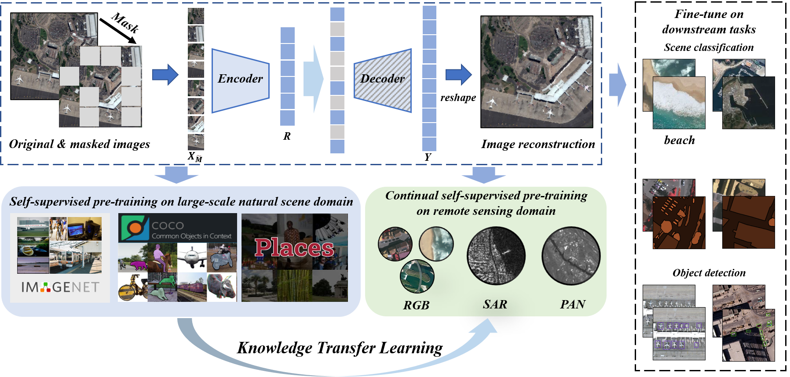

# Don't Stop Pre-training: A Knowledge Transfer Learning Strategy with Unlabelled Data for Remote Sensing Domain Promotion

## Introduction:

Knowledge transfer learning is a fundamental but very important task in computer vision to significantly impact the performance of downstream tasks. Nowadays, for task-aware model training in remote sensing domain (RSD), pre-training on a large-scale dataset of nature scene and then fine-tuned by fewer specific task labeling data, is the consensus for knowledge transfer learning. Unfortunately, under supervised learning manner, and since different categories of imaging data and great challenges of data annotation, there is no large enough and uniform labeling dataset can support a large-scale pre-training in RSD and fine-tuning on downstream tasks. Moreover, the current knowledge transfer learning seems a crude way, which is easily affected by inevitable labeling noise and severe domain gap between nature and remote sensing scenes. Therefore, in this paper, considering self-supervised learning and powerful vision transformer (ViT) architecture, a new knowledge transfer learning strategy based on task-agnostic representation of masked image modeling (MIM) is proposed to gracefully across the domain gap and release a huge potential of unlabelled data for task-aware model training in RSD. Finally, extensive experiments are carried out on eleven datasets in RSD involving three types of downstream tasks (e.g., scene classification, object detection and pixel-wise land cover classification) and two categories of imaging data (e.g., optical and SAR), and results proved that by utilizing the newly designed knowledge transfer learning strategy, almost all downstream tasks in RSD can outperform the previous way of supervised pre-training and fine-tuning and even surpass the state-of-the-art (SOTA) performance without any expensive labeling consuming and carefully model designing.

  

The repository cotains PyTorch implementation and pretrained models of DSPT. 

### Pretrained models:
The pre-trained models are released in [Model Zoo](https://pan.baidu.com/s/1h6MSHWvikwUG_3mbpqr5fw) (code:dspt).

### Updates:
* May 3, 2022: The code is continuously updated and the pre-train models would be uploaded soon.
* May 7, 2022: We release the all pretrained model on various remote sensing downstream tasks.

### Installation:
Please refer to [install.md](install.md) for installation.

### Getting Started: 
Please refer to [get_started.md](get_started.md) for the basic usage.

### Acknowledgement
The code is built using the [MAE](https://github.com/facebookresearch/mae), [MMdetection](https://github.com/open-mmlab/mmdetection) and [BEiT](https://github.com/microsoft/unilm/tree/master/beit) repository.

### Citation
